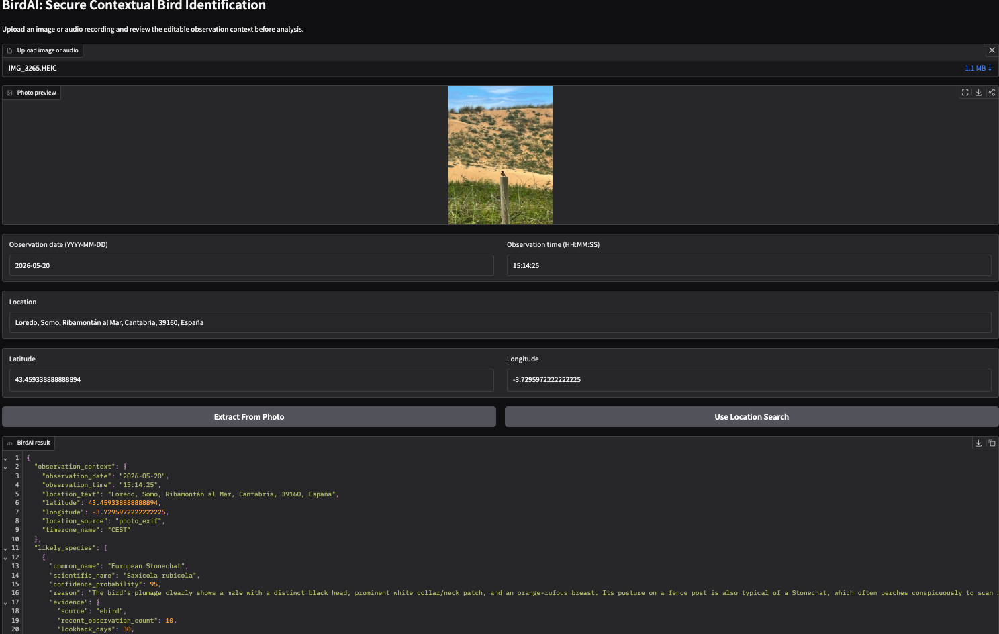

# BirdAI

BirdAI is a context-aware bird identification app for reviewing wildlife observations from photos and audio recordings.

It addresses a common gap in bird ID tools: a media file on its own is often not enough. Real observations depend on where and when they were captured, whether GPS metadata is available, and whether a suggested species is plausible for that place and season. BirdAI brings those pieces together so the result is more useful than a plain label.

## What it solves

Bird watchers, wildlife camera users, and field observers often need more than a top prediction. They need help answering questions like:

- What species is most likely in this photo or recording?
- How certain is that result?
- Does the candidate make sense for this location and season?
- What should I capture next to reduce uncertainty?

BirdAI is built to support that workflow by combining media analysis with observation context and recent-species evidence.

## What the app currently does

- Uploads bird images and audio recordings through a Gradio interface.
- Supports image files such as JPEG, PNG, WebP, and HEIC.
- Supports audio files such as WAV, MP3, FLAC, and OGG.
- Lets the user review or edit observation date, time, location text, latitude, and longitude before analysis.
- Extracts GPS coordinates from photo metadata when available.
- Geocodes location text and reverse-geocodes extracted coordinates.
- Sends the observation to Gemini and returns structured JSON output.
- Returns likely species candidates, uncertainty, ecological plausibility, and a suggested next observation action.
- Adds recent-species evidence using eBird when coordinates are available.
- Falls back to grounded web evidence when eBird enrichment is unavailable.
- Logs analyses to `data/observations.csv`.

## Output

The app returns structured JSON with:

- `likely_species`: ranked bird candidates.
- `uncertainty` and `uncertainty_reasons`: how confident the result is and what limits it.
- `ecological_plausibility`: whether the candidate fits the observation context.
- `suggested_next_action`: the most useful follow-up observation.
- `observation_context`, `modality`, and `warnings`: resolved context and runtime notes.

Example input:


Example output:

```json
{
  "observation_context": {
    "observation_date": "2026-05-20",
    "observation_time": "15:14:25",
    "location_text": "Loredo, Somo, Ribamontán al Mar, Cantabria, 39160, España",
    "latitude": 43.459338888888894,
    "longitude": -3.7295972222222225,
    "location_source": "photo_exif",
    "timezone_name": "CEST"
  },
  "likely_species": [
    {
      "common_name": "European Stonechat",
      "scientific_name": "Saxicola rubicola",
      "confidence_probability": 95,
      "reason": "The bird's plumage clearly shows a male with a distinct black head, prominent white collar/neck patch, and an orange-rufous breast. Its posture on a fence post is also typical of a Stonechat, which often perches conspicuously to scan for insects. These features are highly characteristic of Saxicola rubicola.",
      "evidence": {
        "source": "ebird",
        "recent_observation_count": 10,
        "lookback_days": 30,
        "summary": "eBird reported 10 recent observations in the last 30 days near this location.",
        "species_code": "stonec4",
        "last_observation_date": "2026-05-17 19:46"
      }
    }
  ],
  "uncertainty": "low",
  "uncertainty_reasons": [
    "The image quality is good enough to discern key identification features, and the bird is clearly visible."
  ],
  "ecological_plausibility": {
    "location": "Loredo, Cantabria, Spain (Atlantic coast)",
    "season": "Spring (May)",
    "plausibility": "high",
    "reason": "Stonechats (Saxicola rubicola) are common residents and breeders across most of Spain, including the Cantabrian coast. They frequently inhabit open, scrubby, and coastal dune environments, which matches the observed habitat in the image. Spring is also their active breeding season, making their presence and behavior highly plausible."
  },
  "suggested_next_action": "Observe the bird's behavior, listen for its distinctive 'chack-chack' call, and look for a potential mate or nesting activity to further confirm breeding in the area.",
  "modality": "image",
  "warnings": []
}
```



## Current scope

- Image and audio analysis are supported in the current app.
- Results are context-aware and designed to support observation review, not just species ranking.
- Each run can be stored locally for later review and comparison.

## Running the app

```bash
PYTHONPATH=src python app.py
PYTHONPATH=src pytest
```
